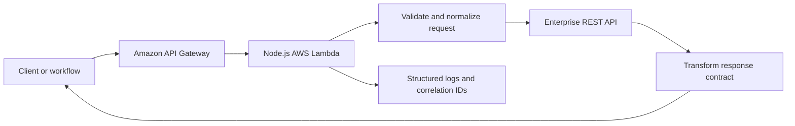
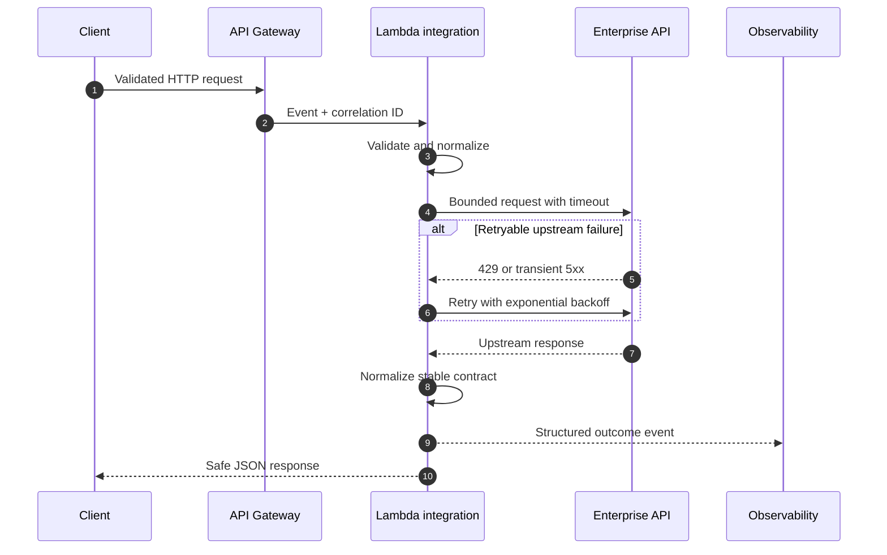

# AWS Lambda API Integration Starter

[](https://github.com/3QInnova/aws-lambda-api-integration-starter/actions/workflows/ci.yml)

An original, production-minded Node.js reference implementation for building resilient API integrations on AWS Lambda.

This repository demonstrates the engineering patterns used when a workflow, application, or contact-center platform must safely exchange data with an upstream enterprise API. It contains no employer or client source code.

## What it demonstrates

- AWS Lambda and HTTP API deployment with the Serverless Framework
- Input validation and stable JSON response contracts
- Correlation IDs propagated across service boundaries
- Timeouts, bounded retries, and exponential backoff
- Safe upstream error handling
- Response normalization for downstream consumers
- Structured JSON logging
- Dependency-injected tests using the built-in Node.js test runner
- GitHub Actions continuous integration
- Stage-driven configuration without committed secrets

## Architecture



### Request lifecycle



## API

### `GET /health`

Returns the service name, stage, and health status.

### `POST /v1/integrations`

Example request:

```json
{
  "customerId": "customer-123",
  "operation": "enrich",
  "context": {
    "channel": "voice"
  }
}
```

Example response:

```json
{
  "data": {
    "customerId": "customer-123",
    "operation": "enrich",
    "outcome": "continue",
    "attributes": {
      "segment": "preferred",
      "status": "active"
    }
  }
}
```

## Run the tests

Requires Node.js 22 or later.

```bash
npm install
npm test
```

## Deploy

Set the upstream API URL in your shell or deployment environment:

```bash
export UPSTREAM_API_URL="https://api.example.com/customer"
npx serverless deploy --stage dev --region us-east-1
```

For a real deployment, replace the example CORS origin in `serverless.yml`, add authentication at API Gateway, and store API credentials in AWS Secrets Manager or Parameter Store.

## Production extensions

A full production implementation would commonly add:

- OAuth 2.0 or signed-request authentication
- AWS Secrets Manager integration
- DynamoDB caching and idempotency controls
- CloudWatch alarms, dashboards, and distributed tracing
- Dead-letter handling for asynchronous workflows
- OpenAPI contract publication
- AWS WAF, private networking, and least-privilege IAM
- Separate Development, QA, Staging, and Production accounts

## License

MIT © 2026 3QInnova LLC
